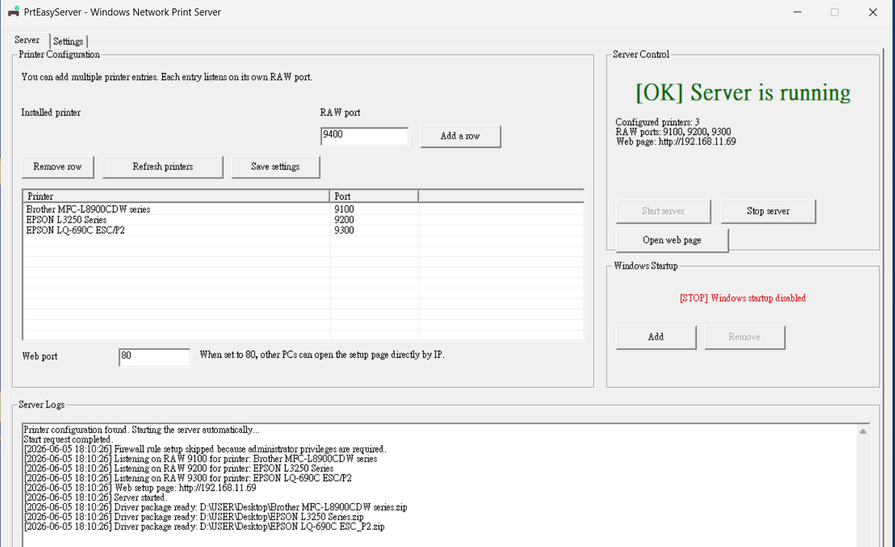
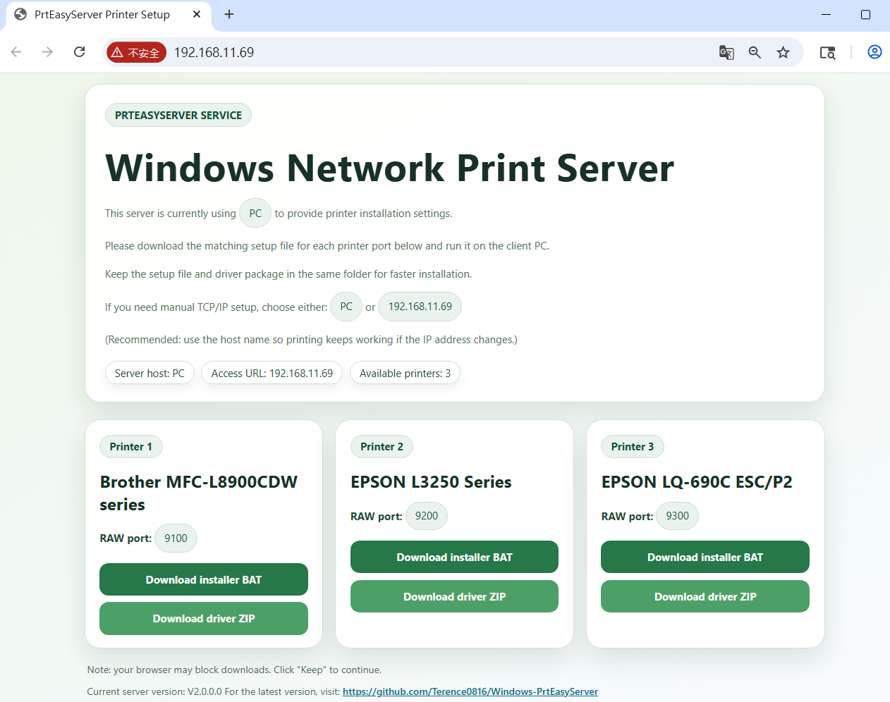
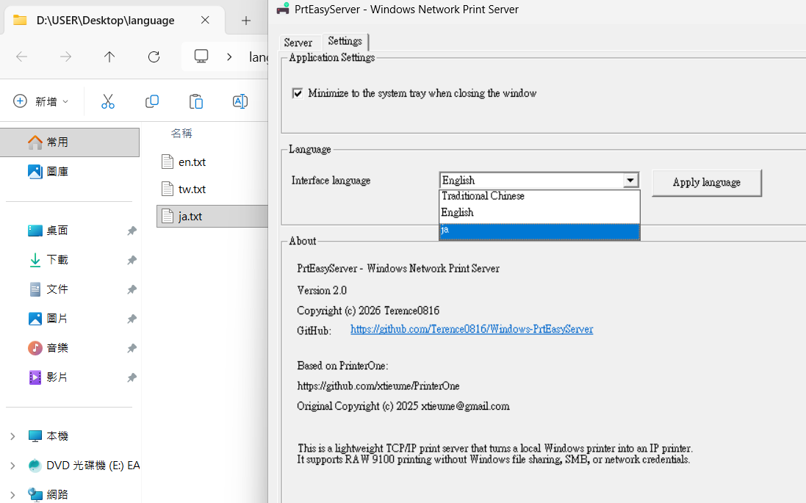
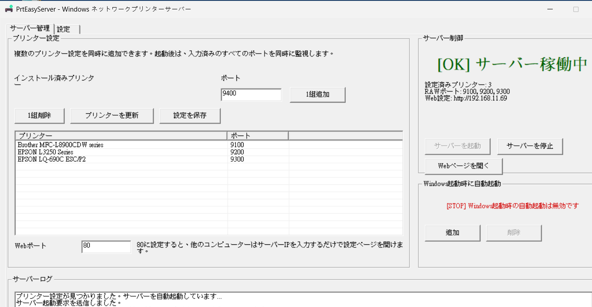
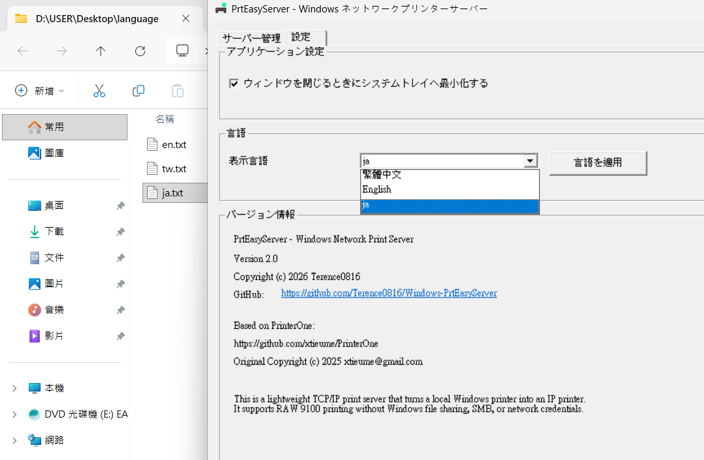
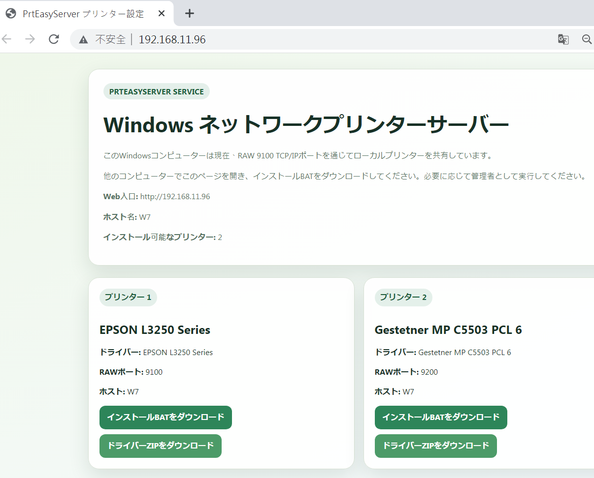
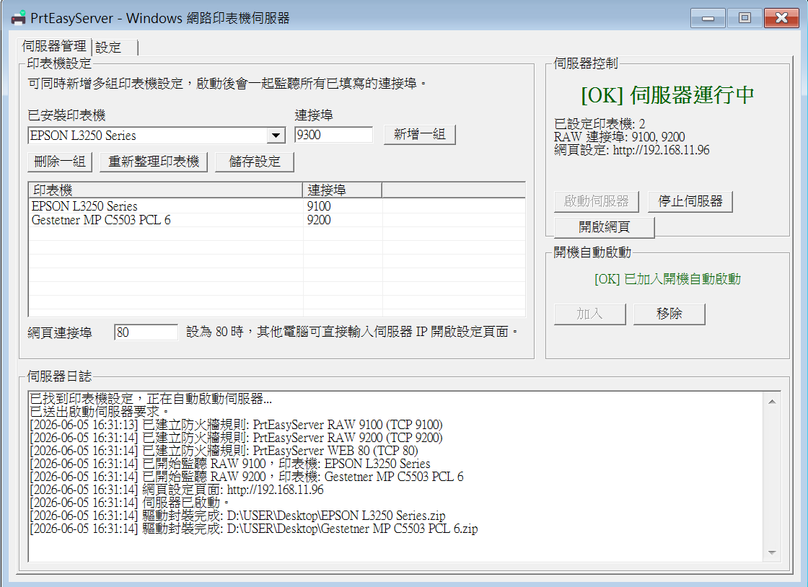
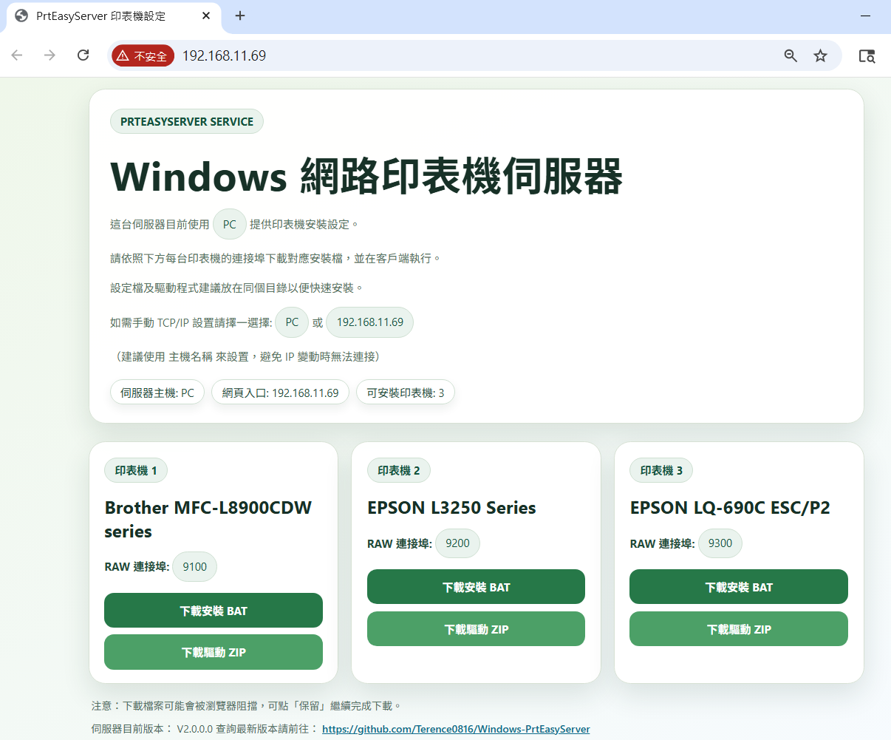
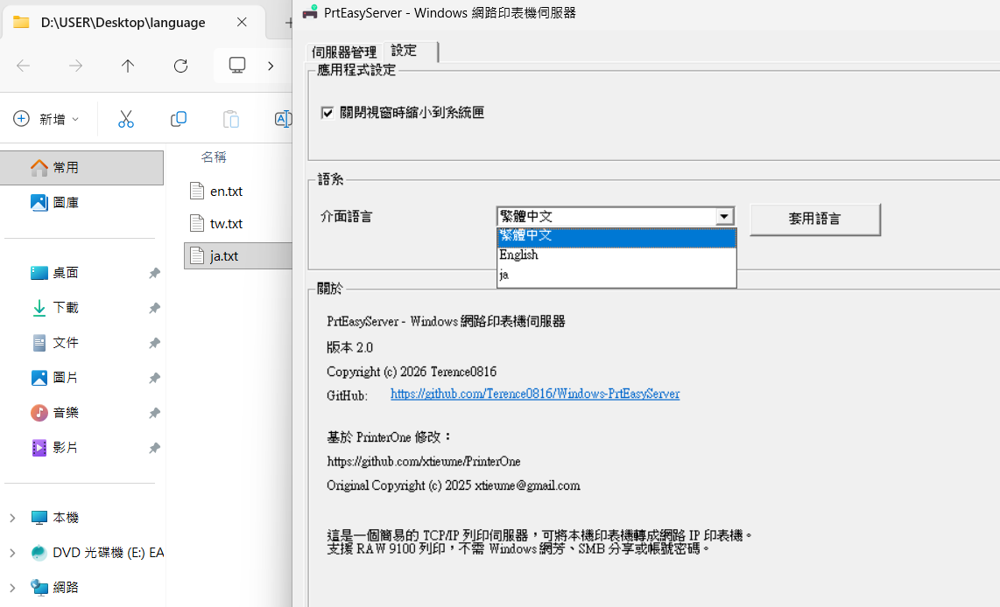

# PrtEasyServer

Native C++ Windows RAW 9100 Network Print Server and TCP/IP Printer Server for local USB printers and Windows-installed printers.

 | [Releases](https://github.com/Terence0816/Windows-PrtEasyServer/releases) | [Latest Official Build `v2.0.0.0`](https://github.com/Terence0816/Windows-PrtEasyServer/releases/download/v2.0.0.0/PrtEasyServer.exe) | [MIT License](./LICENSE)

English | [繁體中文](#zh-tw)

PrtEasyServer is now a native C++ rewrite of the original Python-packaged application. It turns a Windows PC into a lightweight RAW 9100 / TCP-IP printer server, so client PCs can install shared printers through a standard IP port without SMB printer sharing, Windows network neighborhood prompts, or account/password dialogs.

## Version History

### v2.0.0.0

- Major architecture update: the main application was rewritten from the original Python packaged version into a native C++ version.
- Faster startup and improved responsiveness.
- Main executable size reduced dramatically, from about 25 MB in the earliest version to about 728 KB.
- Removed the Python Runtime dependency for a cleaner and lighter runtime environment.
- Improved Windows 7 compatibility compared with the previous Python packaged version.
- Continued support for Windows 7 / 10 / 11.
- Added support for custom `.txt` language files.
- Built-in `tw`, `en`, and `cn` language templates are generated automatically, and users can add files such as `jp.txt` to switch the UI to additional languages.

### v1.2.0.0

- Added Windows 7 server-side support for printer hosting and driver package export.
- Added Windows 7 client-side support for installer BAT execution and automatic driver package installation.
- Reduced packaged file size significantly in the final Python-packaged generation.

### v1.1.1.0

- Replaced Base64 PowerShell launch flow with a readable UTF-8 embedded installer script.

### v1.1.0.0

- Added the built-in web page for installer BAT and driver package download.

### v1.0.0.0

- Initial public release of PrtEasyServer.

## Highlights

- Native C++ x64 main application
- RAW 9100 printer sharing over TCP/IP
- Built-in setup web page
- Automatic installer BAT generation
- Driver package download and installation flow
- Windows 7 / 10 / 11 support
- No Python Runtime dependency in the main application
- Built-in Traditional Chinese and Simplified Chinese language support
- Custom language file support through external `.txt` files

## Repository Layout

- `src/`: main C++ Win32 source code
- `assets/printer.ico`: application icon used by the native resources
- `assets/screenshots/`: README screenshots

The repository now focuses on the native C++ source tree. Local/private helper build scripts are intentionally not included here so the root stays cleaner.

## English Screenshots

### English Main UI

### English Web Page

### English Settings

## Custom Language Example: Japanese via `jp.txt`

The screenshots below show a Japanese UI created by manually adding a custom `jp.txt` language file. This means you can create your own `.txt` language file and use it to switch PrtEasyServer into another language without rebuilding the main program.

### Japanese Main UI via `jp.txt`

### Japanese Settings via `jp.txt`

### Japanese Web Page via `jp.txt`

## Download

- Release page: [Releases](https://github.com/Terence0816/Windows-PrtEasyServer/releases)
- Official `v2.0.0.0` build: [PrtEasyServer.exe](https://github.com/Terence0816/Windows-PrtEasyServer/releases/download/v2.0.0.0/PrtEasyServer.exe)
- GitHub release assets show the current download count for the official build

## Search Keywords

Windows RAW 9100 print server, native C++ print server, TCP/IP printer server, Windows network print server, local USB printer sharing, IP printer setup, no SMB printer sharing, custom language txt, Win32 print server

## Credits

Based on PrinterOne by xtieume.  
Original project: https://github.com/xtieume/PrinterOne  
Original Copyright (c) 2025 xtieume@gmail.com

## License

This repository is released under the MIT License. See [LICENSE](./LICENSE).

---

# 繁體中文

PrtEasyServer 現在已改為原生 C++ 版本，是一個 Windows RAW 9100 網路印表機伺服器，可把本機 USB 印表機或已安裝在 Windows 上的印表機轉成 TCP/IP 網路印表機。使用者可透過標準 IP 連接埠安裝印表機，不需要使用 Windows 網芳或 SMB 印表機分享，也不需要碰到帳號密碼提示。

## 版本更新紀錄

### v2.0.0.0

- 本版本為重大架構更新，主程式已從原本的 Python 打包版本重寫為 C++ 原生版本。
- 主程式改以 C++ 重新編譯，啟動速度與操作反應更快。
- 主程式檔案大小大幅降低，從最初版本約 25MB 降至約 728KB。
- 移除對 Python Runtime 的依賴，執行環境更乾淨。
- 提升 Windows 7 相容性，較原本 Python 打包版本更不容易受到缺少元件或 Runtime 影響。
- 維持 Windows 7 / 10 / 11 支援。
- 支援自定義 `.txt` 語言檔。
- 內建 `tw`、`en` 與 `cn` 語言模板會自動產生，使用者也可自行新增 `jp.txt` 等外部語言檔來切換介面語言。

### v1.2.0.0

- 支援 WIN7 伺服器端架設與打包印表機驅動程式。
- 支援 WIN7 連接端自動執行設定檔與驅動包安裝。
- Python 打包版本末期已大幅減少主程式檔案體積。

### v1.1.1.0

- 安裝 BAT 改為可讀的 UTF-8 明文嵌入式腳本流程。

### v1.1.0.0

- 新增內建網頁，可下載安裝 BAT 與驅動程式。

### v1.0.0.0

- PrtEasyServer 首次公開版本。

## 功能特色

- 原生 C++ x64 主程式
- RAW 9100 TCP/IP 印表機分享
- 內建安裝設定網頁
- 自動產生安裝 BAT
- 驅動程式下載與安裝流程
- 支援 Windows 7 / 10 / 11
- 主程式不再依賴 Python Runtime
- 內建繁體中文與簡體中文支援
- 支援外部 `.txt` 自定義語言檔

## 儲存庫結構

- `src/`：主要 C++ Win32 原始碼
- `assets/printer.ico`：原生資源檔使用的程式圖示
- `assets/screenshots/`：README 畫面截圖

目前 GitHub 儲存庫以原生 C++ 原始碼為主，未放入本機專用的輔助編譯批次檔，讓根目錄維持比較乾淨。

## 中文畫面

### 中文主介面

### 中文網頁

### 繁體設定頁

## 自定義語言範例：手動新增 `jp.txt`

以下畫面示範的是手動新增 `jp.txt` 後切換出的日文介面。也就是說，你可以自行建立其他 `.txt` 語言檔，配合 PrtEasyServer 做額外語言切換，不需要重新編譯主程式。

### 日文主介面（手動建立 `jp.txt`）

### 日文設定頁（手動建立 `jp.txt`）

### 日文網頁（手動建立 `jp.txt`）

## 下載

- 版本下載頁面：[Releases](https://github.com/Terence0816/Windows-PrtEasyServer/releases)
- 正式版 `v2.0.0.0`：[PrtEasyServer.exe](https://github.com/Terence0816/Windows-PrtEasyServer/releases/download/v2.0.0.0/PrtEasyServer.exe)
- GitHub 發行頁右側可查看目前的下載次數

## 搜尋關鍵字

Windows RAW 9100 印表機伺服器、C++ 印表機伺服器、TCP/IP 印表機伺服器、Windows 網路印表機伺服器、USB 印表機分享、IP 印表機安裝、自定義語言 txt、無 SMB 分享、Win32 印表機分享

## 原作與致謝

本專案基於 PrinterOne 修改而成。  
原始專案：https://github.com/xtieume/PrinterOne  
Original Copyright (c) 2025 xtieume@gmail.com

## 授權

本儲存庫目前使用 MIT License，詳見 [LICENSE](./LICENSE)。
